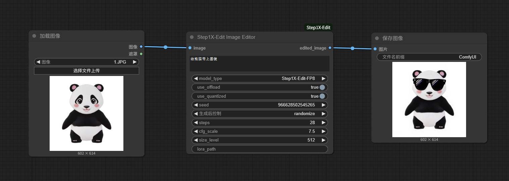

# Cloned from https://github.com/stepfun-ai/Step1X-Edit.git

## Modify the Step1X-Edit to support old GPU which don't support flash_attn and triton
## ComfyUI nodes for Step1X-Edit 

## Workflow


## 🚀 Quick Start

### python module installation
```
# Python310
pip install -r requirements.txt
```

## ComfyUI Custom nodes
```
# Download this github and put it into below path
ComfyUI/custom_nodes/ComfyUI_Step1X-Edit/
```

### Download Model FP8
```
# https://hf-mirror.com/meimeilook/Step1X-Edit-FP8
📁 ComfyUI/models/step1x/Step1X-Edit-FP8/
├── step1x-edit-i1258-FP8.safetensors  
└── vae.safetensors

# https://hf-mirror.com/Qwen/Qwen2.5-VL-7B-Instruct
📁 ComfyUI/models/step1x/Step1X-Edit-FP8/Qwen2.5-VL-7B-Instruct/  
├── model-00001-of-00005.safetensors  
└── ......
```

### Download Model
```
# https://hf-mirror.com/stepfun-ai/Step1X-Edit
📁 ComfyUI/models/step1x/Step1X-Edit/
├── step1x-edit-i1258.safetensors  
└── vae.safetensors

# https://hf-mirror.com/Qwen/Qwen2.5-VL-7B-Instruct
📁 ComfyUI/models/step1x/Step1X-Edit/Qwen2.5-VL-7B-Instruct/  
├── model-00001-of-00005.safetensors  
└── ......
```

